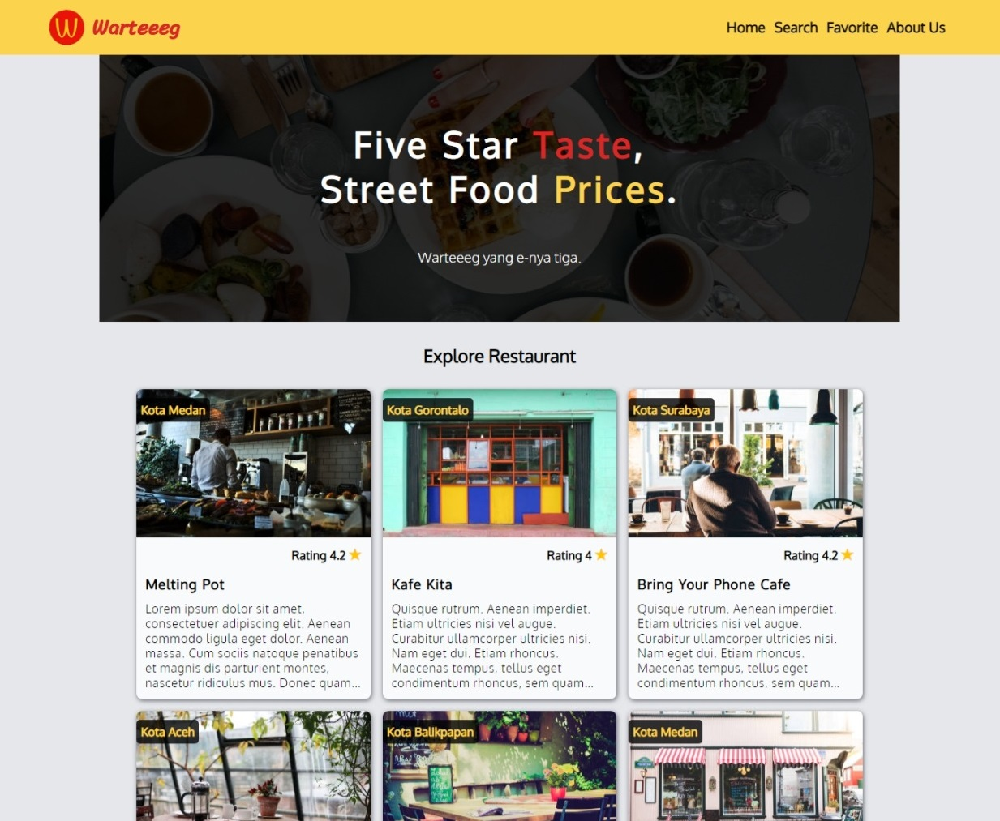

# Warteeg App

Progressive Web App about restaurants catalogue

[**Visit Demo**](https://pwa-warteg-app.web.app)



## Installation

> Requirements:
>
> - Node JS
> - NPM
> - Browser that support Service Worker

- Clone or download repository

    ```bash
    git clone https://github.com/fuadmln/warteeeg-restaurant_apps
    ```

- Install package dependencies

    ```bash
    cd warteeeg-restaurant_apps
    
    npm install
    ```

- Start development server

    ```bash
    npm run start-dev
    ```

- Build for production

    ```bash
    npm run build
    ```

## Tools & Technologies

- Native CSS
- Javascript ES 6
- Responsive design
- Mobile first approach
- Progressive Web App (PWA)
- Service worker
- API Consume
- IndexedDB
- Webpack

## Features

- Add to home screen
- Search restaurants
- Favorite restaurant
- Offline
- Accessible by keyboard (Tab/Shift+Tab)

## Upcoming work & fix

- Skip to content url
- Notification for saved/removed restaurant
